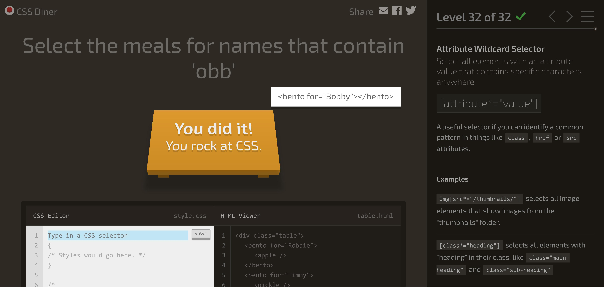

# [CSS](https://github.com/green-fox-academy/teaching-materials/blob/master/preparation/materials/css/css.hu.md)

## [Web Development Basics - CSS](https://www.youtube.com/watch?v=jDBOMsqac0o)

## [CSS Diner](https://flukeout.github.io/#)

## [CSS setup and syntax on Codeacademy](https://www.codecademy.com/courses/learn-css/lessons/learn-css-setup-and-syntax/exercises/intro-to-css)

## [Selectors and Visual Rules on Codeacademy](https://www.codecademy.com/courses/learn-css/lessons/learn-css-selectors/exercises/type)

## [Box model on Codeacademy](https://www.codecademy.com/courses/learn-css/lessons/box-model-intro/exercises/box-model-review)

## [CSS basics](https://developer.mozilla.org/en-US/docs/Learn/Getting_started_with_the_web/CSS_basics)
